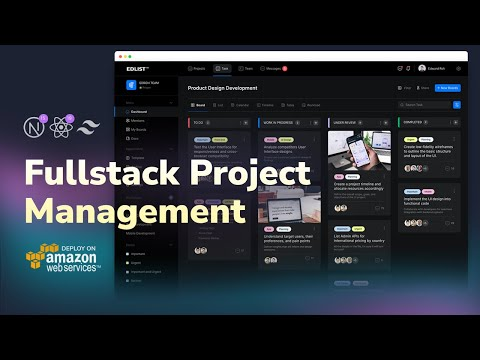

# Project Management Dashboard

<div align="center">
  <br />
      
  <br />

  <div>
    
    
  </div>
</div>

## Technology Stack

- **Frontend**: Next.js, Tailwind CSS, Redux Toolkit, Redux Toolkit Query, Material UI Data Grid
- **Backend**: Node.js with Express, Prisma (PostgreSQL ORM)
- **Database**: PostgreSQL, managed with PgAdmin
- **Cloud**: AWS EC2, AWS RDS, AWS API Gateway, AWS Amplify, AWS S3

## Getting Started

### Prerequisites

Ensure you have these tools installed:

- Git
- Node.js
- npm (Node Package Manager)
- PostgreSQL ([download](https://www.postgresql.org/download/))
- PgAdmin ([download](https://www.pgadmin.org/download/))

### Installation Steps

1. Clone the repository:
   `git clone https://github.com/ataberkakkan/project-management.git`
   `cd project-management`

2. Install dependencies in both client and server:
   `cd client`
   `npm i`
   `cd ..`
   `cd server`
   `npm i`

3. Set up the database:
   `npx prisma generate`
   `npx prisma migrate dev --name init`
   `npm run seed`

4. Configure environment variables:

- `.env` for server settings (PORT, DATABASE_URL)
- `.env.local` for client settings (NEXT_PUBLIC_API_BASE_URL)

5. Run the project
   `npm run dev`

## Additional Resources

### Database Management Commands

- Command for resetting ID in database:
  ```sql
  SELECT setval(pg_get_serial_sequence('"[DATA_MODEL_NAME_HERE]"', 'id'), coalesce(max(id)+1, 1), false) FROM "[DATA_MODEL_NAME_HERE]";
  ```
